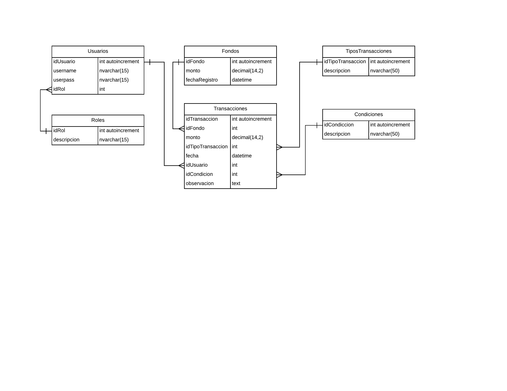

Este test es una prueba que consiste en desarrollar una app wallet en react.
El frontend estará separado con react y el backend con firebase con autentificación de google.
# El enunciado es el siguiente
Crear un sitio web funcional que implemente la funcionalidad de un módulo de fondos(wallet).
Al accesar el sitio, el usuario deberá insertar su nombre de usuario para iniciar sesion. Una vez logueado, se mostrará una pantalla de bienvenida donde habrá un menú que lleve al usuario al módulo de fondos(Wallet). En el módulo de fondos debe aparecer el total de fondos disponibles y el total de fondos retirados, así como una tabla con el historial de transacciones hechas por el usuario, por favor incluir fechas. Deben haber botones de carga y retiro de fondos donde se muestran formularios correspondientes a cada operación.
Debe haber un panel admin donde usuarios con rol de Administrador, pueden ver las solicitudes de retiros de otros usuarios, en este los administradores podrán aprobar las solicitudes o rechazarlas. En caso de rechazar una solicitud, debe haber un textarea que solicite el motivo de rechazo para mostrar al usuario solicitante más tarde.

# Clonar el repositorio
    $ git clone https://github.com/vanckruz/react-app-retiros.git wallet

## Init

Luego instalar los paquetes usados:

    $ cd wallet
    $ npm install
    $ npm start

# Acceder a la url
http://localhost:3000/

## Modelo inicial wallet

